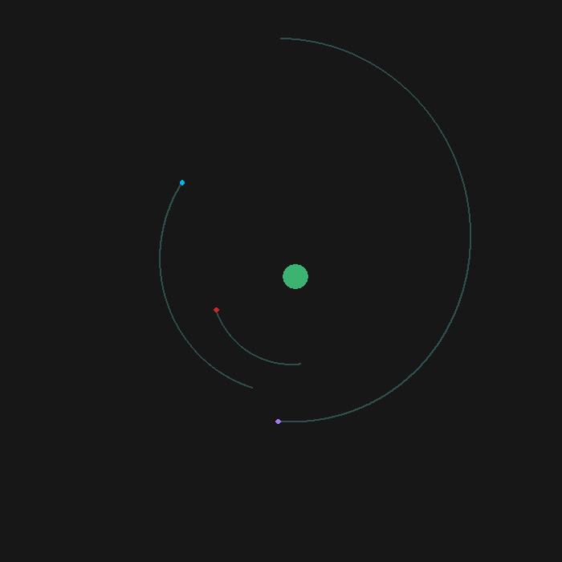
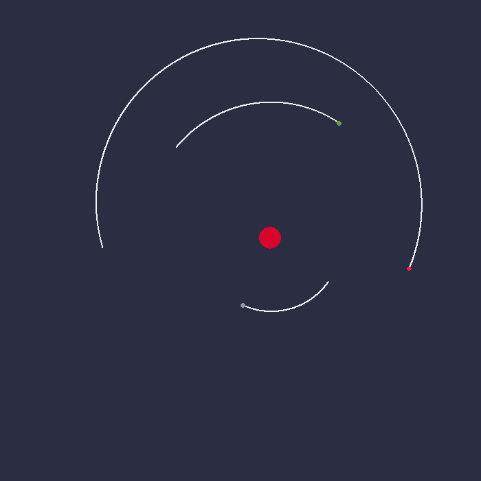
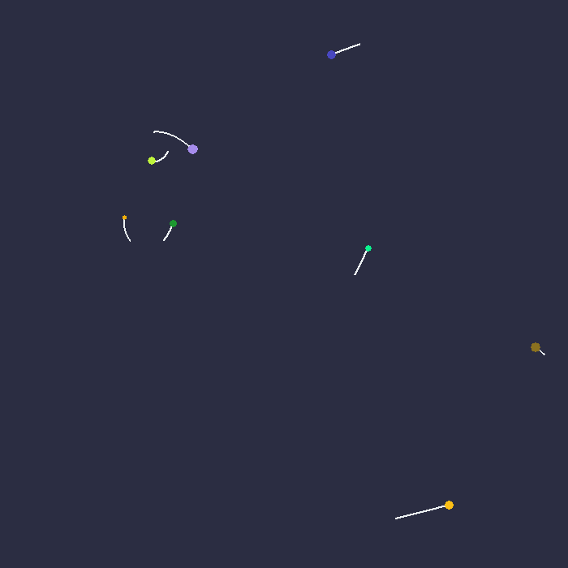

# Gravity Simulator

## Introduction

A simple simulation of gravitational interactions in a 2D space, developed in Python and visualized using Tkinter. The Gravity Simulator approximates the gravitational interactions between multiple bodies using Euler's Method.

## Features

- Simulates gravitational interactions between multiple bodes.
- Visualizes the movement and trails of the bodies.
- Configurable properties for bodies and simulation parameters.
- Allows custom bodies and automatically generated bodies.

## Usage

To run the Gravity Simulator, ensure you have Python installed on your system.

1. Clone the repository.

   ```bash
   git clone git@github.com:styxofsyntax/Gravity-Simulator.git
   ```

2. Open the respective directory in terminal and run the following command.

   ```bash
   python main.py
   ```

## Configuration

```python
properties = {
    'width': X_SIZE,
    'height': Y_SIZE,
    'bg_color': 'gray9',
    'max_time': 10000,
    'start_time': 0,
    'generate_bodies': False,
    'append_bodies': False,
    'bodies': bodies,
    'body': {
        'num_bodies': 5,
        'mass_max': 100,
        'x_max': X_SIZE - 50,
        'y_max': Y_SIZE - 50,
        'velocity_max': 0,
        'trail_length': 40,
        'random_color': False,
        'trail_color': 'darkslategray',
        'color': "medium sea green"
    }
}
```

### Properties

- width: Width of the simulation window.
- height: Height of the simulation window.
- bg_color: Background color of the simulation window.
- max_time: Maximum time frames for the simulation.
- start_time: Initial time frame.
- generate_bodies: Boolean to generate random bodies.
- append_bodies: Boolean to append generated bodies to custom bodies.
- bodies: List of custom bodies.
- body: Configuration for generating random bodies.

### Body Properties

- num_bodies: Number of random bodies to generate.
- mass_max: Maximum mass of random bodies.
- x_max: Maximum x-coordinate for random bodies.
- y_max: Maximum y-coordinate for random bodies.
- velocity_max: Maximum initial velocity for random bodies.
- trail_length: Length of the trail to show for each body.
- random_color: Boolean to assign random colors to bodies.
- trail_color: Color of the trails for random bodies.
- color: Default color for random bodies.

## Screenshots






